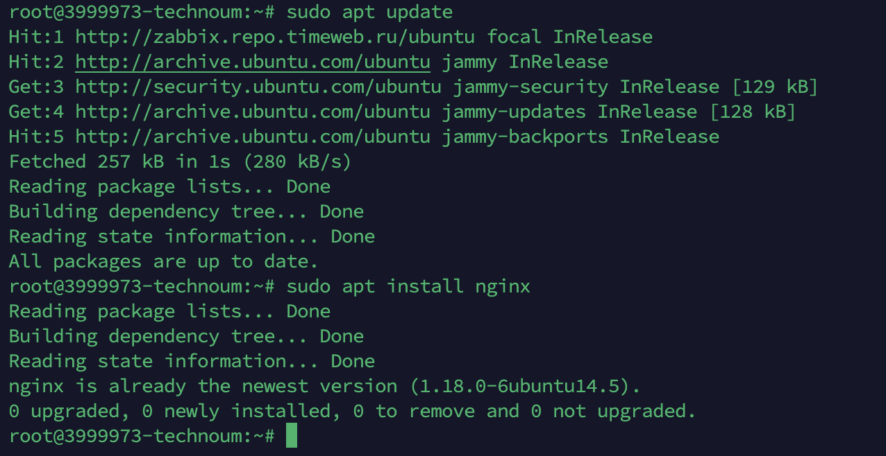
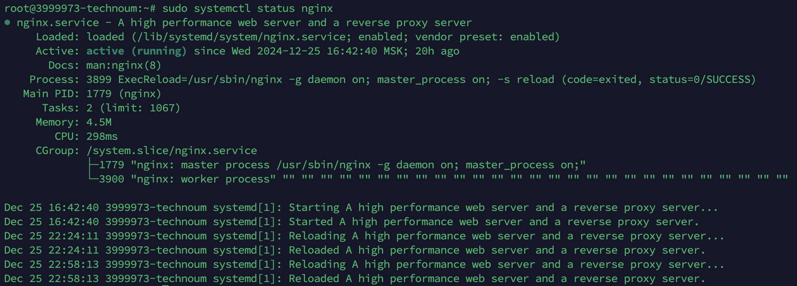
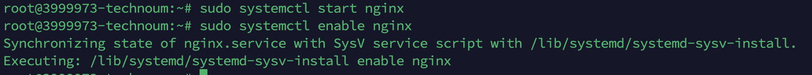
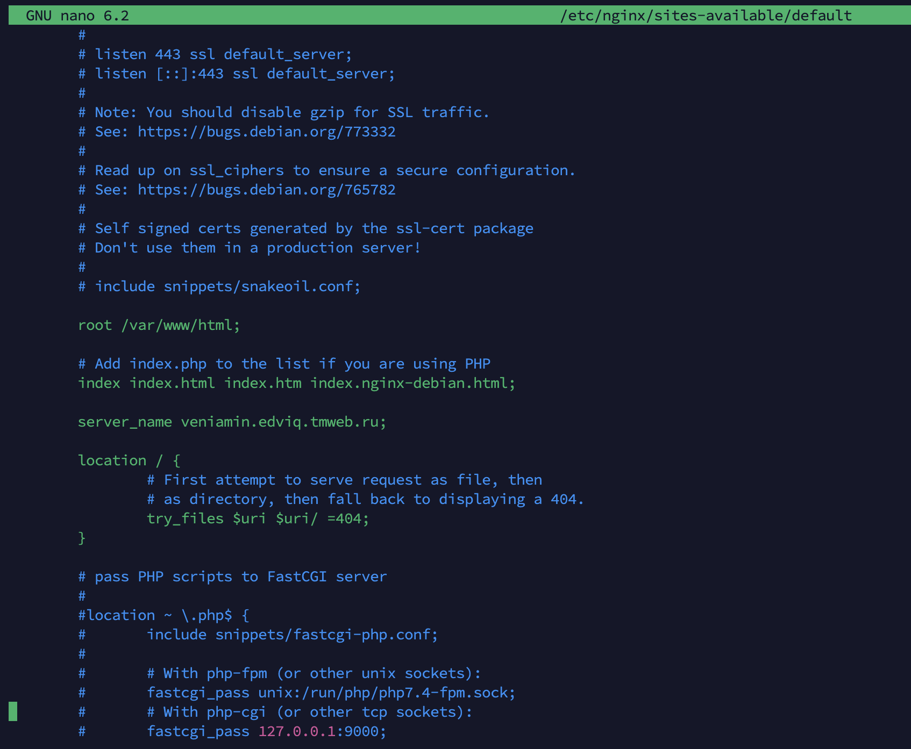
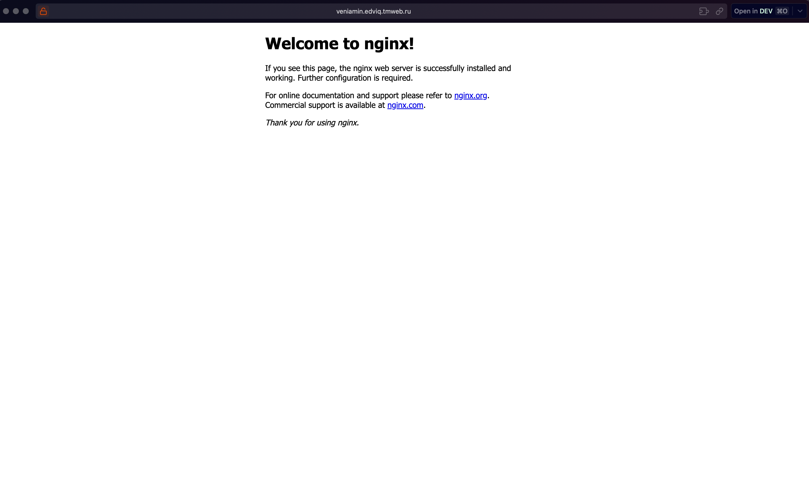
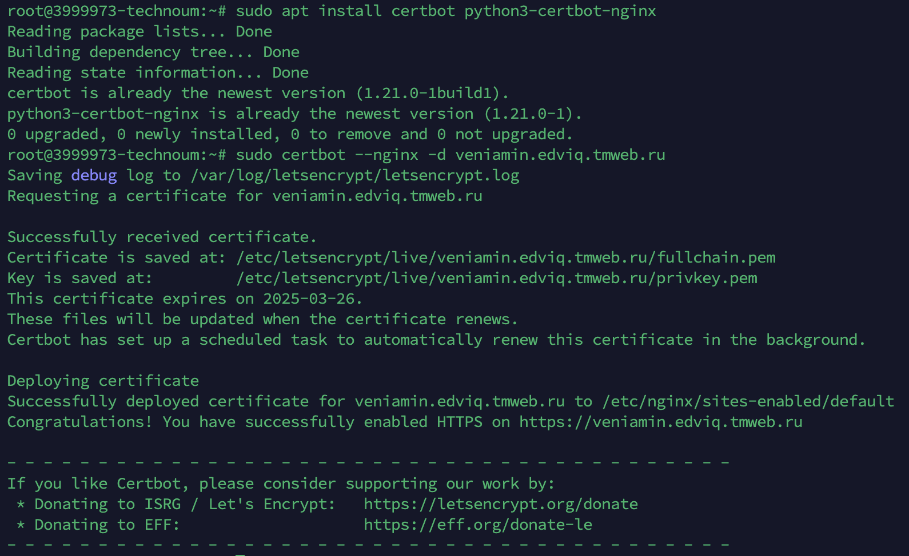
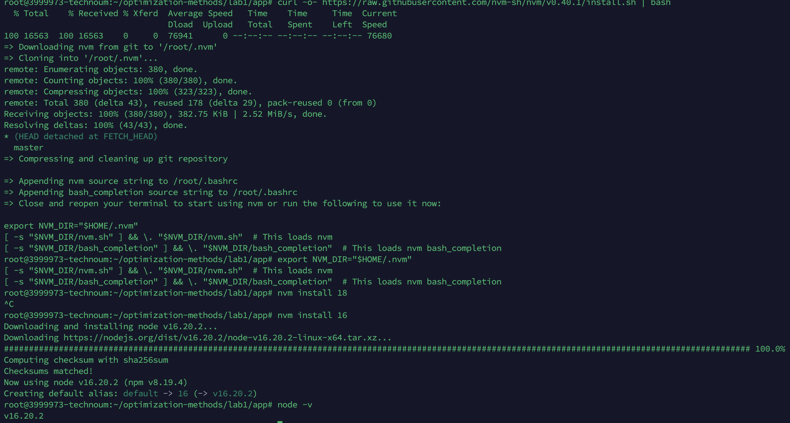
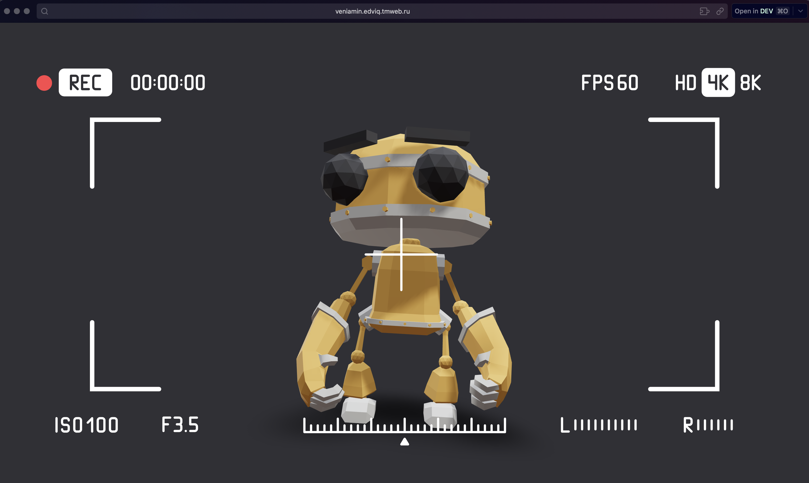

### Лабораторная работа №1 по настройке nginx

---

### **1. Установка и настройка nginx**
1. **Обновляем пакеты и устанавливаем nginx:**
   ```bash
   sudo apt update
   sudo apt install nginx
   ```
   

2. **Проверяем статус nginx:**
   ```bash
   sudo systemctl status nginx
   ```
   
   Если nginx не запущен, выполняем команды:  
   ```bash
   sudo systemctl start nginx
   sudo systemctl enable nginx
   ```
   

---

### **2. Проверка и добавление домена в nginx**
1. **Открываем конфигурацию nginx:**
   ```bash
   sudo nano /etc/nginx/sites-available/default
   ```
2. **Проверяем наличие домена veniamin.edviq.tmweb.ru в блоке server_name:**
   Пример:
   ```nginx
   server {
       listen 80;
       server_name veniamin.edviq.tmweb.ru;
       root /var/www/html;
       index index.html index.htm;

       location / {
           try_files $uri $uri/ =404;
       }
   }
   ```
    
3. **Если домен отсутствует, добавляем его и сохраняем изменения.**

4. **Проверяем синтаксис конфигурации nginx:**
   ```bash
   sudo nginx -t
   ```
   

5. **Перезагружаем nginx:**
   ```bash
   sudo systemctl reload nginx
   ```

6. **Проверяем доступность домена в браузере:**
   - Открываем http://veniamin.edviq.tmweb.ru и убеждаемся, что сервер отвечает.
   
---

### **3. Установка и настройка HTTPS (сертификат Let's Encrypt)**
1. **Устанавливаем Certbot и плагин для nginx:**  
   ```bash
   sudo apt install certbot python3-certbot-nginx
   ```
2. **Получаем SSL-сертификат для домена veniamin.edviq.tmweb.ru:**  
   ```bash
   sudo certbot --nginx -d veniamin.edviq.tmweb.ru
   ```
    
3. **Проверяем автообновление сертификатов:**  
   ```bash
   sudo certbot renew --dry-run
   ```
---

### **4. Принудительное перенаправление HTTP на HTTPS**
Добавляем следующий блок в конфигурацию nginx:
```nginx
server {
    listen 80;
    server_name veniamin.edviq.tmweb.ru;
    return 301 https://$host$request_uri;
}
```

---

### **5. Настройка alias для псевдонимов путей**
```nginx
server {
    listen 443 ssl;
    server_name veniamin.edviq.tmweb.ru;

    ssl_certificate /etc/letsencrypt/live/veniamin.edviq.tmweb.ru/fullchain.pem;
    ssl_certificate_key /etc/letsencrypt/live/veniamin.edviq.tmweb.ru/privkey.pem;

    root /var/www/optimization-methods;

    # Пример alias для статических файлов
    location /static/ {
        alias /var/www/optimization-methods/static/;
    }

    index index.html index.htm;

    location / {
        try_files $uri $uri/ /index.html;
    }
}
```

---

### **6. Проверка конфигурации nginx**
1. **Проверяем синтаксис конфигурации:**  
   ```bash
   sudo nginx -t
   ```
2. **Перезапускаем nginx:**  
   ```bash
   sudo systemctl reload nginx
   ```

---

### **7. Загрузка проекта и сборка React-приложения**
1. **Скачиваем проект из репозитория:**
   ```bash
   git clone https://github.com/veniameen/optimization-methods.git
   ```

2. **Переходим в папку с приложением:**
   ```bash
   cd optimization-methods/lab1/app
   ```

3. **Устанавливаем nvm, node и npm:**
   ```bash
   curl -o- https://raw.githubusercontent.com/nvm-sh/nvm/v0.40.1/install.sh | bash
   nvm install 16
   nvm use 16 
   ```
    
4. **Устанавливаем зависимости:**
   ```bash
   npm install
   ```

5. **Собираем проект:**
   ```bash
   npm run build
   ```

6. **Перемещаем папку сборки dist в нужное место для nginx:**
   ```bash
   sudo mv build /var/www/optimization-methods
   ```

---

### **8. Тестирование работы сервера**
1. **Проверяем доступность HTTPS в браузере:**
   - Открываем браузер и переходим по адресу: https://veniamin.edviq.tmweb.ru
    

2. **Проверяем перенаправление с HTTP на HTTPS:**
   - Вводим:  
     http://veniamin.edviq.tmweb.ru
   - Должно автоматически перейти на HTTPS.

3. **Проверяем отображение React-приложения:**
   - Убеждаемся, что React-приложение собрано и отображается в браузере по указанному домену.

4. **Проверяем работу alias:**
   - Открываем пример URL для статических файлов:  
     https://veniamin.edviq.tmweb.ru/static/test.css

---

### **Итоги работы**
Мы успешно настроили сервер для работы по HTTPS с перенаправлением с HTTP, поддержкой React-приложения и alias для статических файлов. 🚀🎉