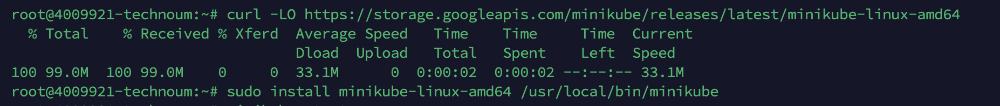
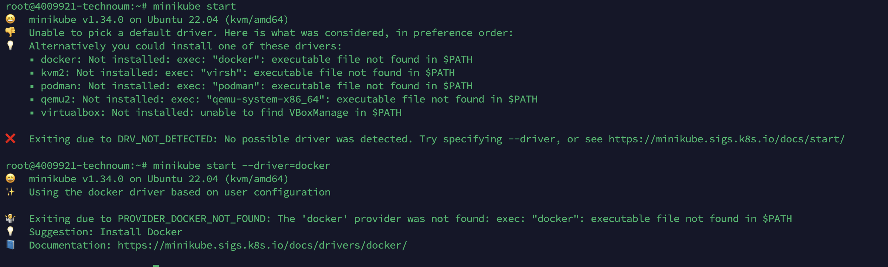
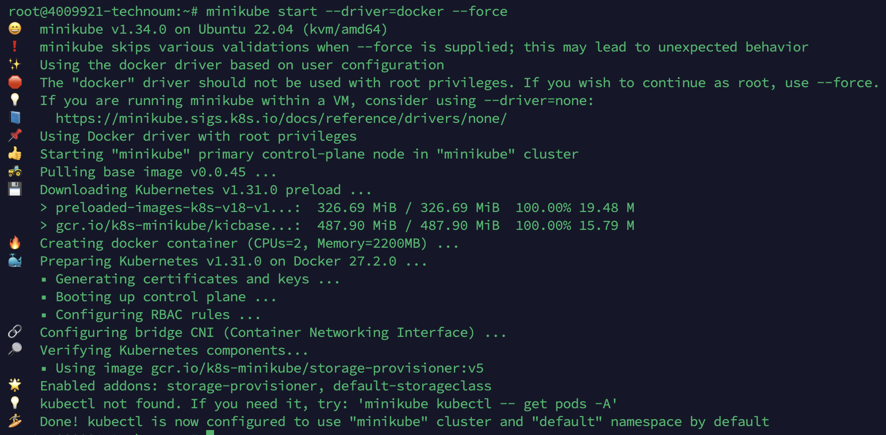
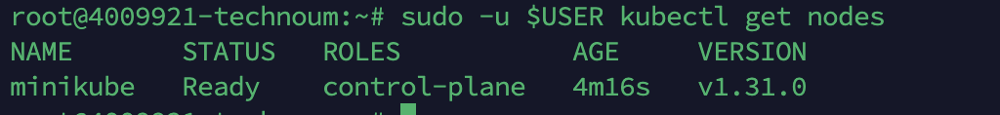
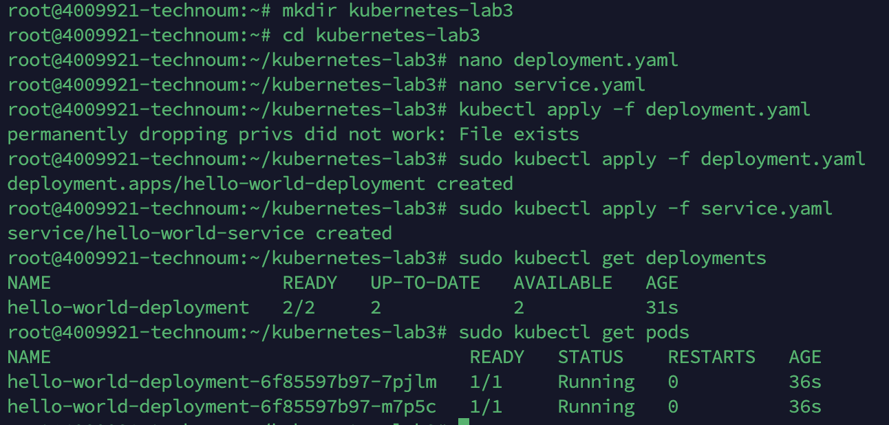
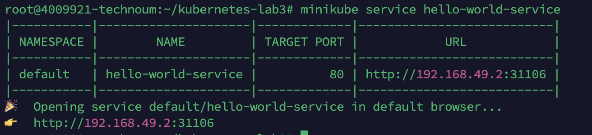
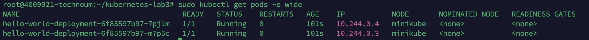

### Лабораторная работа №3: Развёртывание сервиса в VDS

---

## **1. Подготовка окружения**

1. **Устанавливаем Minikube:**
   ```bash
   curl -LO https://storage.googleapis.com/minikube/releases/latest/minikube-linux-amd64
   sudo install minikube-linux-amd64 /usr/local/bin/minikube
   ```
    

2. **Устанавливаем kubectl:**
   ```bash
   sudo snap install kubectl --classic
   ```

3. **Запускаем кластер Minikube:**
   ```bash
   minikube start
   ```

### **Если возникает ошибка запуска Minikube**

#### Ошибка отсутствия драйвера:
Если Minikube не может найти подходящий драйвер, будет предложено установить один из них, например Docker. 

1. **Пробуем запустить с драйвером Docker:**
   ```bash
   minikube start --driver=docker
   ```
2. **Если Docker не установлен, устанавливаем его:**
   ```bash
   sudo apt update
   sudo apt install -y docker.io
   sudo systemctl start docker
   sudo systemctl enable docker
   sudo usermod -aG docker $USER
   newgrp docker
   ```
3. **Повторно запускаем Minikube с драйвером Docker:**
   ```bash
   minikube start --driver=docker
   ```
   

#### Ошибка запуска Minikube от root:
Если Minikube выдаёт ошибку "The \"docker\" driver should not be used with root privileges":

1. **Запускаем Minikube с флагом --force:**
   ```bash
   minikube start --driver=docker --force
   ```
   

2. **Или используем драйвер none для запуска от root:**
   ```bash
   minikube start --driver=none
   ```

3. **Проверяем состояние кластера:**
   ```bash
   kubectl get nodes
   ```

#### Ошибка "permanently dropping privs did not work: File exists":
Эта ошибка возникает из-за запуска kubectl с правами root. 

1. **Запускаем команду с понижением привилегий:**
   ```bash
   sudo -u $USER kubectl get nodes
   ```
   
2. **Если ошибка сохраняется, проверяем права доступа к конфигурации Kubernetes:**
   ```bash
   sudo chown -R $USER:$USER $HOME/.kube $HOME/.minikube
   sudo chmod -R 755 $HOME/.kube $HOME/.minikube
   ```
3. **Перезапускаем Minikube и проверяем узлы:**
   ```bash
   minikube stop
   minikube start --driver=none
   kubectl get nodes
   ```

---

## **2. Создание файлов с манифестами Kubernetes**

1. **Создаём рабочую папку для проекта:**
   ```bash
   mkdir kubernetes-lab3
   cd kubernetes-lab3
   ```

2. **Создаём файл deployment.yaml:**
   ```bash
   nano deployment.yaml
   ```
3. **Вставляем в файл deployment.yaml:**
```yaml
apiVersion: apps/v1
kind: Deployment
metadata:
  name: hello-world-deployment
  labels:
    app: hello-world
spec:
  replicas: 2
  selector:
    matchLabels:
      app: hello-world
  template:
    metadata:
      labels:
        app: hello-world
    spec:
      containers:
      - name: hello-world
        image: nginx:alpine
        ports:
        - containerPort: 80
```
4. **Сохраняем и выходим (Ctrl+O, Enter, Ctrl+X).**

5. **Создаём файл service.yaml:**
   ```bash
   nano service.yaml
   ```
6. **Вставляем в файл service.yaml:**
```yaml
apiVersion: v1
kind: Service
metadata:
  name: hello-world-service
spec:
  selector:
    app: hello-world
  ports:
  - protocol: TCP
    port: 80
    targetPort: 80
  type: NodePort
```
7. **Сохраняем и выходим (Ctrl+O, Enter, Ctrl+X).**

---

## **3. Развёртывание сервиса в Kubernetes**

1. **Применяем манифесты:**
   ```bash
   sudo kubectl apply -f deployment.yaml
   sudo kubectl apply -f service.yaml
   ```

2. **Проверяем статус развёртывания:**
   ```bash
   sudo kubectl get deployments
   sudo kubectl get pods
   ```
   

3. **Получаем доступ к сервису:**
   ```bash
   minikube service hello-world-service
   ```
   
   После выполнения команды откроется браузер с выводом сервиса "Hello World".

---

## **4. Описание используемых ресурсов**

1. **Deployment** — управляет развёртыванием и масштабированием реплик подов. Гарантирует, что в кластере всегда работает заданное количество подов.
2. **Service** — предоставляет стабильную точку доступа к подам, абстрагируя детали их работы. Использует балансировку нагрузки для равномерного распределения трафика.

---

## **5. Тестирование работоспособности сервиса**

1. **Проверяем состояние подов:**
   ```bash
   sudo kubectl get pods -o wide
   ```
   
2. **Тестируем доступность сервиса в браузере через NodePort.**
   Пример ссылки: `http://<minikube_ip>:<nodeport>`

---

## **6. Итоги работы**
Мы развернули локальный Kubernetes кластер с помощью Minikube. Если возникли ошибки с драйверами, использовали драйвер Docker и установили его при необходимости. В случае запуска с root-привилегиями применили флаг --force или драйвер none. Установили и настроили kubectl. Исправили ошибки с правами доступа и привилегиями. Создали файлы манифестов deployment.yaml и service.yaml в папке kubernetes-lab3. Развёртывание и доступность сервиса были проверены в браузере. 🚀🎉

