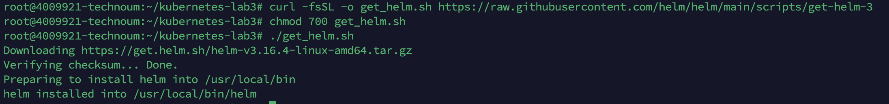
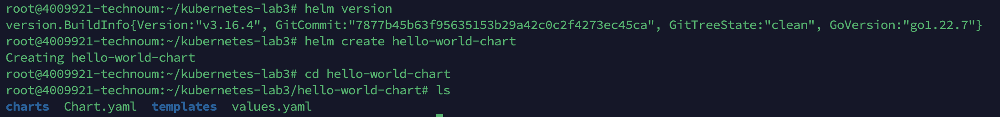
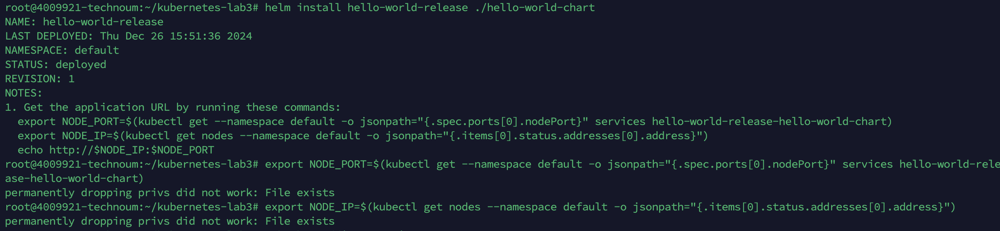
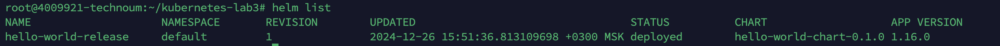
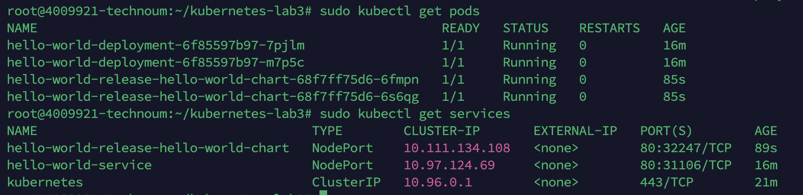

### Лабораторная работа №3 (со звездочкой): Использование Helm для деплоя в Kubernetes

---

## **1. Установка Helm**

1. **Скачиваем и устанавливаем Helm:**
   ```bash
   curl -fsSL -o get_helm.sh https://raw.githubusercontent.com/helm/helm/main/scripts/get-helm-3
   chmod 700 get_helm.sh
   ./get_helm.sh
   ```
    
2. **Проверяем версию Helm:**
   ```bash
   helm version
   ```
---

## **2. Создание Helm-чарта**

1. **Создаём новый чарт:**
   ```bash
   helm create hello-world-chart
   ```

2. **Переходим в папку с чартом:**
   ```bash
   cd hello-world-chart
   ```
    
3. **Редактируем values.yaml:**
   ```bash
   nano values.yaml
   ```

4. **Изменяем настройки по умолчанию:**
```yaml
replicaCount: 2

image:
  repository: nginx
  tag: alpine
  pullPolicy: IfNotPresent

service:
  type: NodePort
  port: 80

resources: {}
```

5. **Редактируем deployment.yaml в шаблонах:**
   ```bash
   nano templates/deployment.yaml
   ```
   Пример шаблона deployment:
```yaml
apiVersion: apps/v1
kind: Deployment
metadata:
  name: {{ .Release.Name }}-deployment
  labels:
    app: {{ .Release.Name }}
spec:
  replicas: {{ .Values.replicaCount }}
  selector:
    matchLabels:
      app: {{ .Release.Name }}
  template:
    metadata:
      labels:
        app: {{ .Release.Name }}
    spec:
      containers:
      - name: {{ .Chart.Name }}
        image: "{{ .Values.image.repository }}:{{ .Values.image.tag }}"
        ports:
        - containerPort: 80
```
    
---

## **3. Деплой Helm-чарта в кластер**

1. **Устанавливаем чарт:**
   ```bash
   helm install hello-world-release ./hello-world-chart
   ```
   

2. **Проверяем статус релиза:**
   ```bash
   helm list
   ```
    
3. **Проверяем состояние подов и сервисов:**
   ```bash
   sudo kubectl get pods
   sudo kubectl get services
   ```
    
4. **Тестируем доступность сервиса:**
   ```bash
   minikube service hello-world-release
   ```

---

## **4. Обновление сервиса (апгрейд релиза)**

1. **Меняем образ в values.yaml:**
   ```bash
   nano values.yaml
   ```
   Изменяем:
```yaml
image:
  repository: nginx
  tag: latest
```

2. **Применяем изменения через апгрейд:**
   ```bash
   helm upgrade hello-world-release ./hello-world-chart
   ```

3. **Проверяем статус обновления:**
   ```bash
   helm history hello-world-release
   ```

4. **Проверяем доступность новой версии:**
   ```bash
   minikube service hello-world-release
   ```

---

## **5. Три причины, почему Helm удобнее классического деплоя**

1. **Упрощённое управление версиями:**
   - Helm позволяет легко откатывать изменения к предыдущей версии с помощью команды:
     ```bash
     helm rollback hello-world-release 1
     ```
   - Это упрощает отладку и развёртывание новых функций.

2. **Переиспользуемость шаблонов:**
   - Использование переменных и шаблонов в Helm-чартах позволяет быстро настраивать параметры деплоя для разных окружений.
   - Один чарт можно переиспользовать для DEV, STAGING и PROD с разными значениями.

3. **Простота обновлений и интеграций:**
   - Helm обеспечивает удобные инструменты для обновления приложений без необходимости изменения множества YAML-файлов вручную.
   - Легко управляет зависимостями и обновляет их с помощью команд:
     ```bash
     helm dependency update
     ```

---

## **7. Итоги работы**
Мы создали Helm-чарт для развертывания сервиса в Kubernetes, задеплоили его в кластер и выполнили обновление версии с помощью команды upgrade. Привели три основных преимущества Helm перед классическим деплоем через манифесты. 🚀🎉

