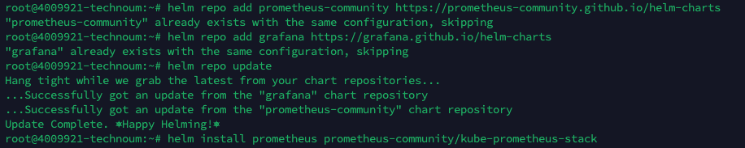
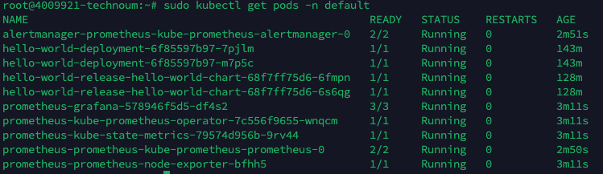
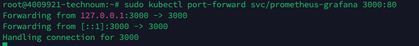
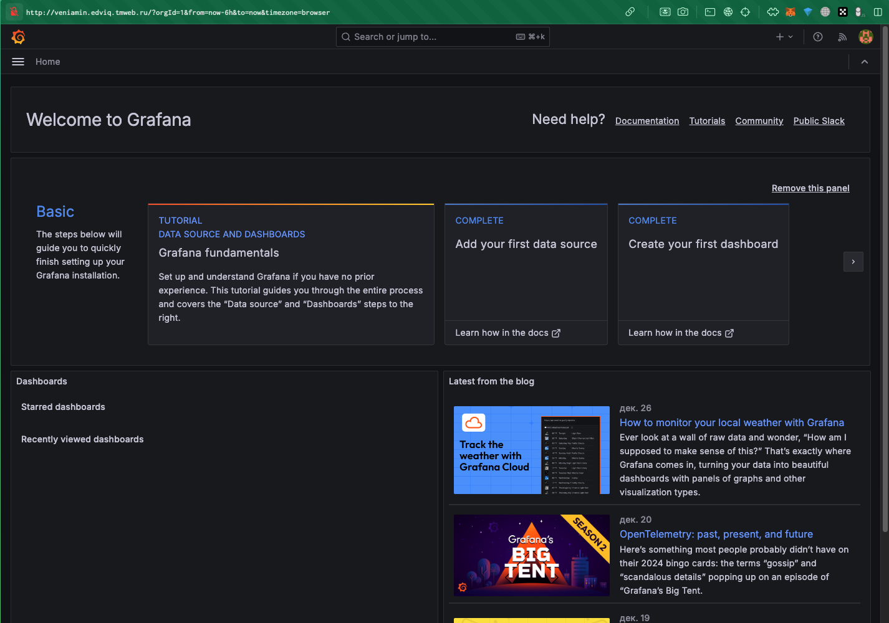
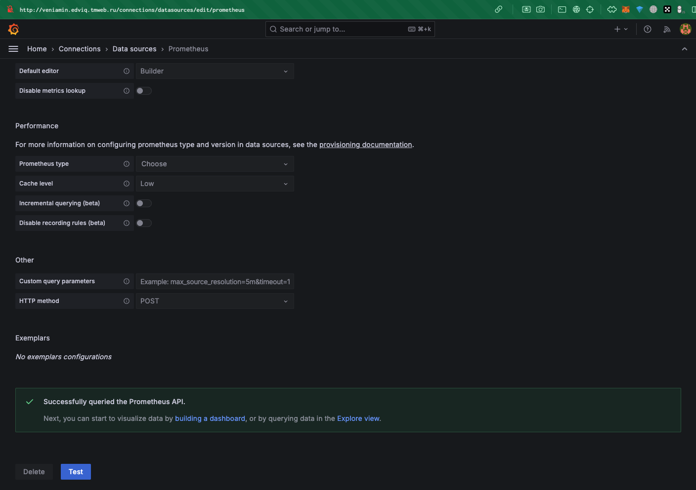
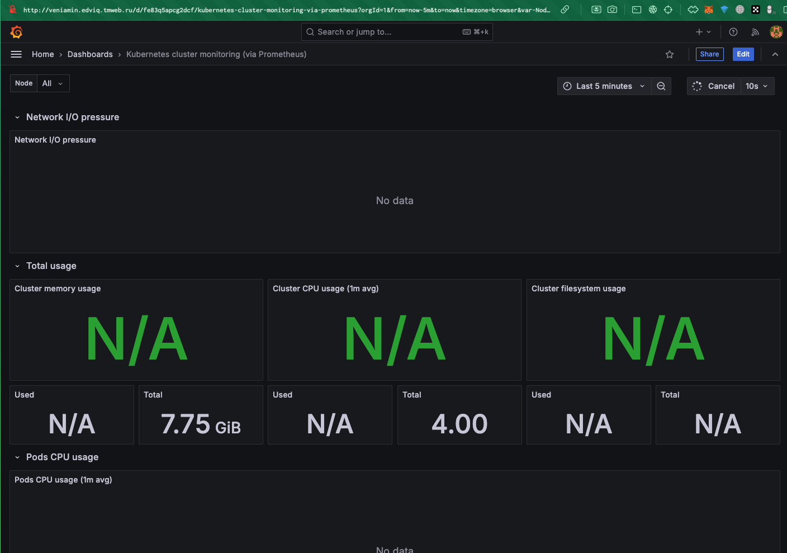

### Лабораторная работа №5

---

## **1. Установка Prometheus и Grafana в Kubernetes**

1. **Добавляем Helm-репозиторий для мониторинга:**
   ```bash
   helm repo add prometheus-community https://prometheus-community.github.io/helm-charts
   helm repo add grafana https://grafana.github.io/helm-charts
   helm repo update
   ```

2. **Устанавливаем Prometheus и Grafana с помощью Helm:**
   ```bash
   helm install prometheus prometheus-community/kube-prometheus-stack
   ```
    
3. **Проверяем установку:**
   ```bash
   sudo kubectl get pods -n default
   ```
   

4. **Запускаем проброс порта Grafana:**
   ```bash
   sudo kubectl port-forward svc/prometheus-grafana 3000:80
   ```
   

---

## **2. Установка и настройка Nginx**

1. **Устанавливаем Nginx:**
   ```bash
   sudo apt update
   sudo apt install nginx
   ```

2. **Запускаем и проверяем статус Nginx:**
   ```bash
   sudo systemctl start nginx
   sudo systemctl enable nginx
   sudo systemctl status nginx
   ```

3. **Настраиваем доступ к Grafana через домен:**

- Открываем конфигурацию Nginx:
   ```bash
   sudo nano /etc/nginx/sites-available/default
   ```

- Добавляем новый блок:
```nginx
server {
    listen 80;
    server_name veniamin.edviq.tmweb.ru;

    location / {
        proxy_pass http://localhost:3000;
        proxy_set_header Host $host;
        proxy_set_header X-Real-IP $remote_addr;
        proxy_set_header X-Forwarded-For $proxy_add_x_forwarded_for;
        proxy_set_header X-Forwarded-Proto $scheme;
    }
}
```

- Проверяем синтаксис конфигурации:
   ```bash
   sudo nginx -t
   ```

- Перезапускаем Nginx:
   ```bash
   sudo systemctl reload nginx
   ```

4. **Открываем Grafana через домен:**
   ```
   http://veniamin.edviq.tmweb.ru
   ```
   Логин по умолчанию:
   - **Username:** admin
   - **Password:** prom-operator
    
---

## **3. Настройка мониторинга метрик приложения**

### **1. Добавляем аннотации в Deployment для экспорта метрик:**

1. **Открываем файл Deployment:**
   ```bash
   nano deployment.yaml
   ```
2. **Находим секцию metadata и добавляем аннотации:**
```yaml
apiVersion: apps/v1
kind: Deployment
metadata:
  name: hello-world-deployment
  labels:
    app: hello-world
  annotations:
    prometheus.io/scrape: 'true'
    prometheus.io/port: '80'
spec:
  replicas: 2
  selector:
    matchLabels:
      app: hello-world
  template:
    metadata:
      labels:
        app: hello-world
    spec:
      containers:
      - name: hello-world
        image: nginx:alpine
        ports:
        - containerPort: 80
```
3. **Сохраняем изменения (Ctrl+O, Enter, Ctrl+X).**
4. **Применяем обновлённый Deployment:**
   ```bash
   sudo kubectl apply -f deployment.yaml
   ```
5. **Проверяем, что изменения применились:**
   ```bash
   sudo kubectl describe deployment hello-world-deployment
   ```
   В выводе должны быть видны добавленные аннотации.

---

## **4. Настройка Grafana для отображения данных**

1. **Добавляем Data Source в Grafana:**
   - Заходим в меню "Settings" → "Data Sources" → "Add Data Source".
   - Выбираем "Prometheus" и указываем URL: `http://prometheus-server.default.svc.cluster.local:80`.
   - Сохраняем настройки.
   

2. **Добавляем Dashboard для визуализации метрик:**
   - Заходим в "Dashboards" → "Import".
   - Вставляем ID популярного Dashboard для Kubernetes: **315**.
   - Применяем настройки и сохраняем.
   

---

## **5. Примеры графиков и визуализаций**

### **График 1: Нагрузка на CPU и использование памяти подов**
   - Мониторит текущее использование CPU и памяти в разрезе подов.
   - График строится на основе метрик Prometheus, таких как `container_cpu_usage_seconds_total` и `container_memory_usage_bytes`.

### **График 2: HTTP-запросы и их статус-коды**
   - Отслеживает количество HTTP-запросов и их статус-коды (200, 404, 500).
   - График строится на основе метрики `nginx_ingress_controller_requests_total`.

---

## **6. Итоги работы**
Мы настроили систему мониторинга для Kubernetes с помощью Prometheus и Grafana. Реализовали сбор и визуализацию метрик для состояния подов и HTTP-запросов. Установили и настроили Nginx для проксирования Grafana по домену veniamin.edviq.tmweb.ru. Представили два рабочих графика, которые показывают ключевые параметры производительности системы. 🚀📊

